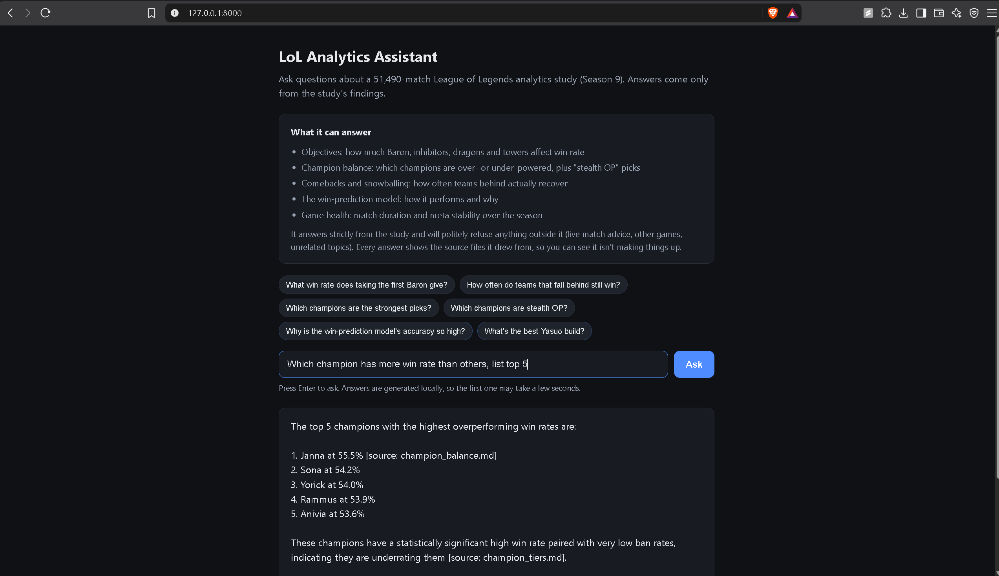
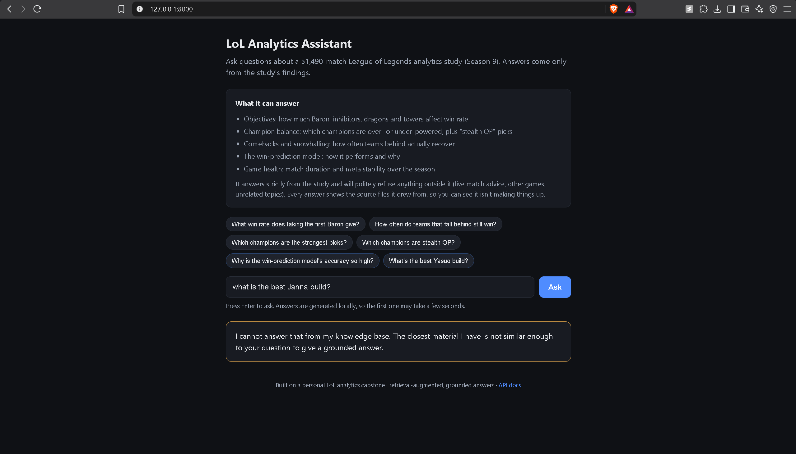

# LoL Analytics RAG Assistant

A retrieval-augmented assistant over the findings of my 51,490-match
League of Legends analytics capstone (Season 9, 2017). It answers only
from the knowledge base and refuses questions the corpus cannot ground.
The refusal guardrail is the point of the project.

It ships with a clean web interface (question box, clickable examples, and
answers that show their sources), a command-line mode, and a REST API.

Built with AI pair-programming assistance. Every design decision below is
one I can explain and defend.

## Architecture

    knowledge_base/*.md -> chunker -> Retriever (tfidf | embeddings)
                                           |
                        guardrail: top-1 score vs per-backend threshold
                                           |
                           refuse  <-------+-------> prompt -> LLM backend
                                                      (mock | ollama | anthropic)

    web page  ->  FastAPI /ask endpoint  ->  the pipeline above

- One Retriever interface, two implementations. TF-IDF is the fast,
  interpretable baseline; embeddings (MiniLM + Chroma) is the semantic
  upgrade. Both plug into the same contract so evals compare them fairly.
- Per-backend refusal thresholds, derived empirically with
  evals/calibrate_thresholds.py.
- Mock LLM backend so the whole pipeline tests offline with zero API cost.

## Quickstart

### 1. Install

    pip install -r requirements.txt

### 2. (Optional) Enable real answers with Ollama

The app works out of the box, but by default (without Ollama) it returns a
placeholder answer while still doing real retrieval and grounding. For real
written answers, install Ollama (free, local, no API key):

1. Install Ollama from https://ollama.com
2. Pull the model:  `ollama pull llama3.1`
3. Make sure Ollama is running (on Windows/Mac it runs in the background
   after install; confirm with `ollama list`)

If Ollama is not running, the app automatically falls back to the
placeholder backend, so it still starts and works.

### 3. Run the web app

    uvicorn api:app --reload

Leave this terminal open (it is the running server). Then open your browser
to:

    http://127.0.0.1:8000/

You will see the assistant with example questions you can click, or type
your own. To stop the server, press Ctrl+C in the terminal.

### Other ways to use it

    python cli.py --retriever embeddings   # ask questions in the terminal
    pytest tests/ -v                        # run the test suite
    python -m evals.calibrate_thresholds --retriever embeddings

The raw API is also available: interactive docs at
http://127.0.0.1:8000/docs, and a POST endpoint at /ask.

## What the knowledge base contains

Real findings from the capstone, including: Baron is the most decisive
single objective (81.2% win rate, 89.6% with Tower and Dragon); 46 of 138
champions differ significantly from a 50% win rate after Benjamini-Hochberg
correction; a set of low-ban high-win "stealth OP" champions (Sona, Yorick,
Rammus); and a strong snowball curve where a team behind in towers wins
only about 2.1% of games.

## A real calibration finding

The refusal guardrail needs a score threshold that separates in-scope
questions from out-of-scope ones. TF-IDF could not do this cleanly: some
valid questions (e.g. "which champions are stealth OP") scored below some
unrelated gaming questions (e.g. "best Yasuo build"), because TF-IDF
matches words, not meaning, and gaming vocabulary leaks similarity. The
calibration script reported this overlap rather than hiding it.

Switching to embeddings fixed it. On the same query sets, in-scope scores
(min 0.448) sat clearly above out-of-scope scores (max 0.400), a clean
separation, and the calibrated threshold of 0.424 answers every in-scope
question while refusing every out-of-scope one. See
docs/retriever_comparison.md for the full numbers.

The assistant refuses questions it cannot ground in the capstone, rather than inventing an answer:

## Status

- [x] Chunker, dual retrievers, guardrail, three LLM backends, CLI, tests
- [x] Real capstone findings across the knowledge base
- [x] Embeddings calibration + TF-IDF vs embeddings writeup
- [x] FastAPI service (/ask + /health) with request validation and tests
- [x] Web interface served by FastAPI
- [ ] Docker + cloud deployment (next phase)
